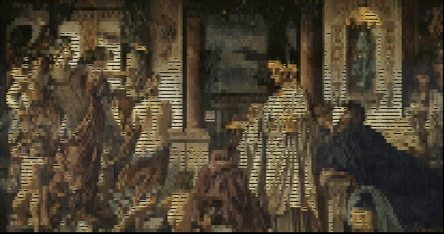

<p align="center">
  
</p>

<h1 align="center">Janus~</h1>

<p align="center">
  <b>Multi-Model AI Orchestration System</b>
</p>

<p align="center">
  <a href="https://github.com/AI-et-al/Janus-/blob/main/LICENSE"></a>
  
  
  
</p>

---

## Introduction

**Janus** (named after the Roman god of transitions and duality) coordinates multiple AI agents working in parallel. It looks both forward—routing to the best model for each task—and backward—learning from past sessions through persistent memory.

Part of **[AI et al.](https://github.com/AI-et-al)** — a cooperative of humans and AI building meaningful tools together.

## Highlights

- **Multi-Model Orchestration** — Route tasks to Claude, GPT-4, Gemini, or local models based on capability and cost
- **Persistent Memory** — Cross-session context that survives restarts and learns from every interaction
- **Real-Time Dashboard** — Monitor active agents, track costs, and view research insights live
- **Observable AI** — Every decision logged, every disagreement surfaced, full audit trail

## Quick Start

```bash
# Clone the repository
git clone https://github.com/AI-et-al/Janus-.git
cd Janus-

# Start the dashboard
cd janus-dashboard && python -m http.server 8080
# Open http://localhost:8080
```

## Components

| Component | Purpose | Status |
|-----------|---------|--------|
| **janus-dashboard** | Real-time monitoring UI | ✅ Active |
| **claude-mem** | Persistent cross-session memory | ✅ Active |
| **claudelytics** | Usage analytics and cost tracking | ✅ Active |
| **llm-council** | Multi-model deliberation | ✅ Available |
| **agentic-flow** | Workflow orchestration | ✅ Available |

## Dashboard

Real-time agent monitoring with glassmorphism UI:

- **Agent Status** — Live view of all active Claude instances
- **Animated Indicators** — Glowing effects for active agents
- **Memory Integration** — View and search persistent memory
- **Interactive Controls** — Refresh, filter, command palette (Cmd+K)

## Design Principles

**The Karpathy Constraint** — Every feature must provide genuine leverage beyond basic web searches.

**Observable Disagreement** — When AI agents disagree, we surface it rather than suppress it.

**Memory as Infrastructure** — Context isn't ephemeral. Every session builds on previous ones.

## Roadmap

- [x] Real-time agent dashboard
- [x] Persistent memory integration
- [x] SMS notifications
- [ ] Multi-provider model routing
- [ ] Cost optimization engine
- [ ] LLM Council integration

## License

MIT License — see [LICENSE](./LICENSE) for details.

---

<p align="center">
  <b>AI et al.</b><br>
  <i>Humans and AI, building together</i>
</p>
